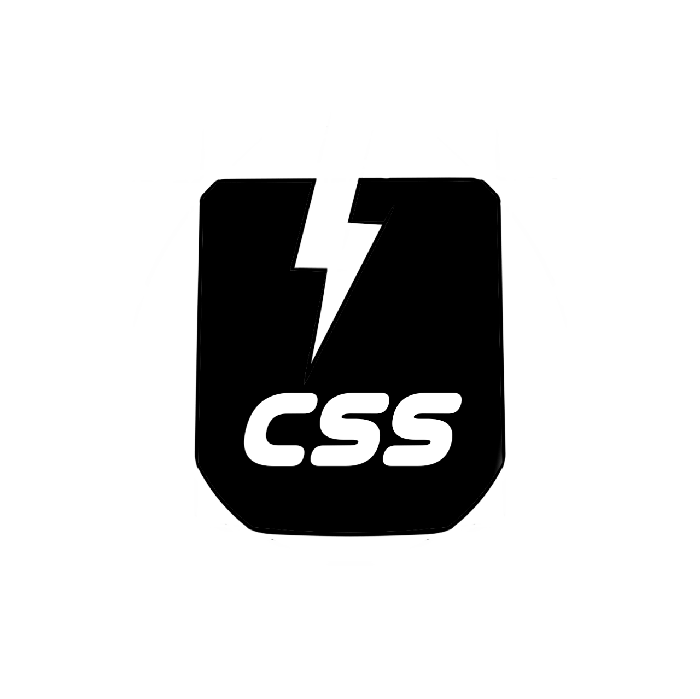

<h1 align = "center" > W E L C O M E ! </h1>

<h1 align="center">Hi 👋, I'm Manikandan Srinivasalu</h1>
<h3 align="center">B.Tech student at GSBT tamilnadu,India.  frontend developer,desktop application developer(python)</h3>

- 🔭 I’m currently working on **use css (a minimalistic css framework for ui development)**

- 🌱 I’m currently learning **DSA**

- ⚡ Fun fact **Independant artist under the name manikandansrinivasalu**

## creator , author and developer of " USE " - css framework

<h3 align="left">Languages and Tools:</h3>

 

 
 
 
 
 

